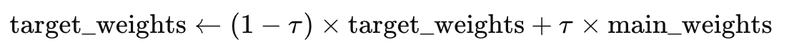

# Explicação de τ (tau) no DQN com Stable Baselines3

No algoritmo Deep Q-Network (DQN) implementado no Stable Baselines3, o parâmetro τ (tau) desempenha um papel crucial na atualização dos pesos da rede neural alvo. Este processo é conhecido como "soft update" (ou “Polyak update”) e ajuda a estabilizar o treinamento da rede neural.

## O que é τ (tau)?

Em DQN, a rede neural alvo é uma cópia da rede neural principal, mas suas atualizações são feitas de forma mais suave e menos frequente. Isso é feito para evitar a oscilação excessiva dos valores Q estimados. A atualização suave é controlada pelo parâmetro τ (tau), que determina a fração com a qual os pesos da rede neural principal influenciam os pesos da rede neural alvo a cada passo de atualização.

## Como τ (tau) é aplicado?

A aplicação do coeficiente é descrita na imagem abaixo:

